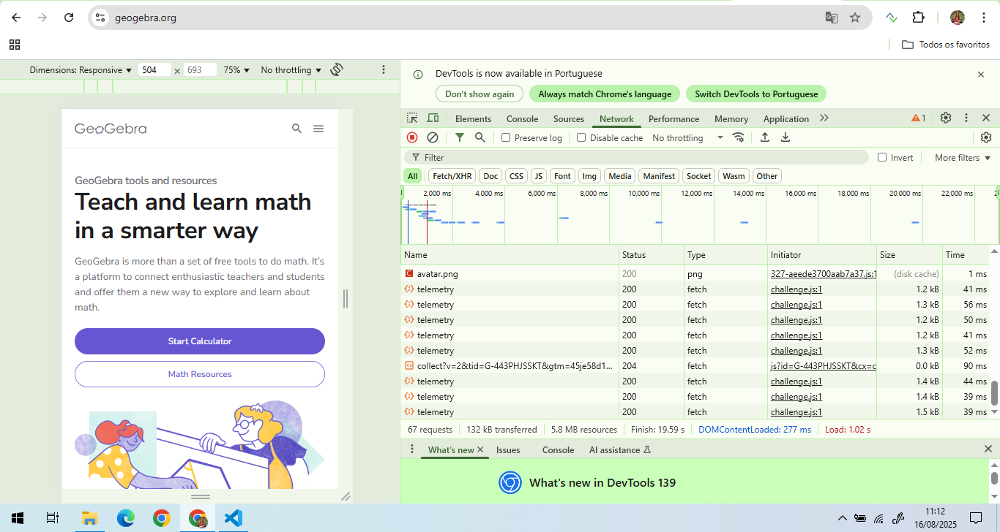
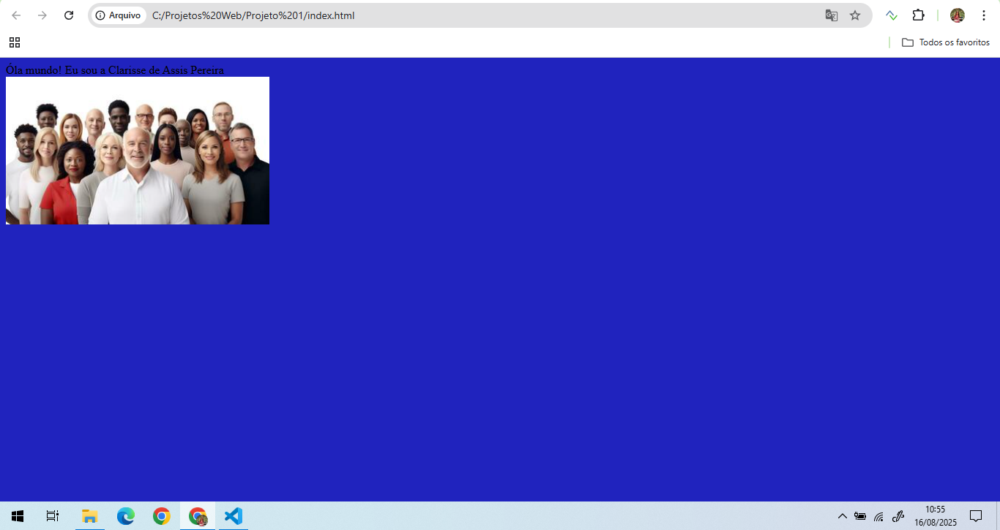

# Projeto de Configuração do Ambiente

## Informações do Aluno
- **Nome:** Clarisse de Assis Pereira  
- **Matrícula:** 903541

## Teste de inspeção de conexão
Abaixo está o print feito com as ferramentas do desenvolvedor (aba Network) mostrando os arquivos carregados pelo navegador ao acessar um site:

